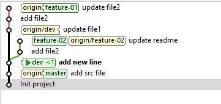
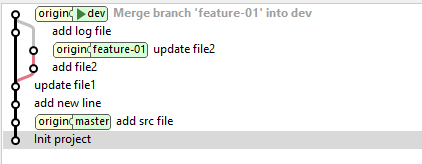
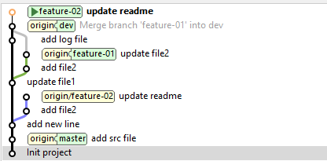
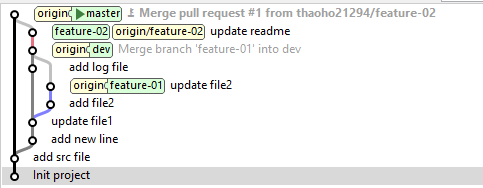

## A project to practice git command

1. Connecting to GitHub with SSH

2. add branch dev, feature-01(create from dev), feature-02(create from dev)

3. add collaborators

4. git cherry-pick commit "add file2" from feature-01 to feature-02

5. git merge feature-01 to dev

6. git rebase feature-02 to dev

7. merge pull request from feature-02 to master

